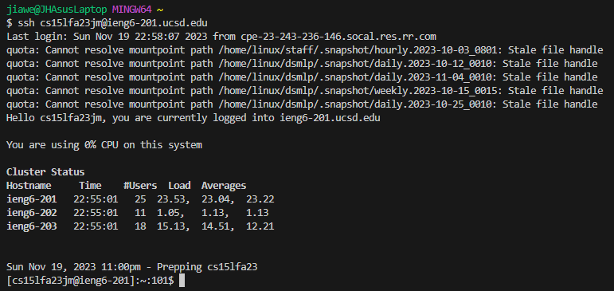

**Step 4**

Keys pressed: `ssh cs15lfa23jm@ieng6-201.ucsd.edu -> <Enter>`

**Step 5**

Keys pressed: `git clone git@github.com:jiaweihuang22/lab7.git -> <Enter> -> ls -> <Enter> -> cd lab7 - > <Enter>`

**Step 6**

Keys pressed: `bash test.sh -> <Enter>`

**Step 7**

Keys pressed: `Vim ListExamples.java -> <Enter> -> Shift+g -> k (6 times) -> e -> x -> i -> 2 -> esc -> :wq -> <Enter>`

**Step 8**

Keys pressed: `bash test.sh -> <Enter>`

**Step 9**

Keys pressed: `git commit ListExamples.java -> <Enter> -> i -> h -> i -> esc -> :wq -> <Enter> -> git push git@github.com:jiaweihuang22/lab7.git -> <Enter>`

